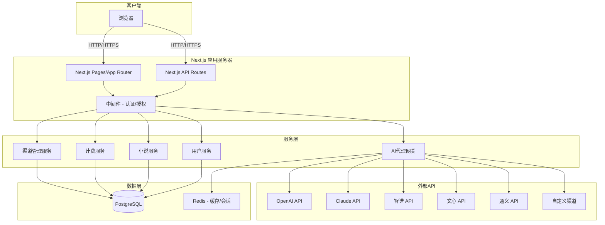

# 小说编写平台技术设计

Feature Name: novel-writing-platform
Updated: 2026-05-03

## 描述

一个基于Next.js的全栈小说编写平台，提供用户注册登录、管理员后台管理、多API渠道支持、AI辅助编写、完整写作工作台（大纲、角色卡、世界观、章节管理）和按token计费系统。数据库使用PostgreSQL。

## 架构



### 架构说明

- **前端**: Next.js App Router + React + TypeScript
- **后端**: Next.js API Routes + Server Actions
- **数据库**: PostgreSQL（主数据库）
- **缓存**: Redis（会话、请求限流、支付状态）
- **ORM**: Prisma
- **AI代理网关**: 统一封装多个大模型API，支持负载均衡和故障转移
- **认证**: NextAuth.js + JWT
- **支付**: 支付宝开放API + 微信支付API + 通用支付链接 + 卡密系统
- **版本控制**: 自定义Git-like版本管理系统

## 组件和接口

### 1. 用户服务 (UserService)

**接口**:
- `register(email, password)` - 用户注册
- `login(email, password)` - 用户登录
- `getProfile(userId)` - 获取用户信息
- `updateProfile(userId, data)` - 更新用户信息
- `addAdminRole(userId, adminCode)` - 授予管理员权限

### 2. 小说服务 (NovelService)

**接口**:
- `createNovel(userId, novelData)` - 创建小说
- `getNovel(userId, novelId)` - 获取小说详情
- `updateNovel(userId, novelId, data)` - 更新小说
- `deleteNovel(userId, novelId)` - 删除小说
- `listNovels(userId)` - 列出用户的所有小说

### 3. 章节服务 (ChapterService)

**接口**:
- `createChapter(novelId, chapterData)` - 创建章节
- `getChapter(chapterId)` - 获取章节内容
- `updateChapter(chapterId, content)` - 更新章节
- `deleteChapter(chapterId)` - 删除章节
- `listChapters(novelId)` - 列出所有章节
- `reorderChapters(novelId, order)` - 重新排序章节

### 4. 大纲服务 (OutlineService)

**接口**:
- `createOutline(novelId, outlineData)` - 创建大纲
- `getOutline(novelId)` - 获取大纲
- `updateOutline(novelId, data)` - 更新大纲
- `deleteOutline(novelId)` - 删除大纲

### 5. 角色卡服务 (CharacterService)

**接口**:
- `createCharacter(novelId, charData)` - 创建角色
- `getCharacter(charId)` - 获取角色详情
- `updateCharacter(charId, data)` - 更新角色
- `deleteCharacter(charId)` - 删除角色
- `listCharacters(novelId)` - 列出所有角色

### 6. AI代理网关 (AIGateway)

**接口**:
- `generate(prompt, model, options)` - 生成文本
- `estimateCost(model, inputTokens, outputTokens)` - 预估费用
- `selectChannel(model)` - 选择可用渠道
- `fallbackGenerate(prompt, model, fallbackModels)` - 故障转移生成

### 7. 计费服务 (BillingService)

**接口**:
- `calculateCost(modelId, inputTokens, outputTokens)` - 计算费用
- `deductBalance(userId, amount)` - 扣除余额
- `getBalance(userId)` - 查询余额
- `getUsageHistory(userId, pagination)` - 获取使用记录
- `grantInitialBalance(userId)` - 发放初始额度

### 8. 支付服务 (PaymentService)

**接口**:
- `createPaymentOrder(userId, amount, paymentMethod)` - 创建支付订单
- `getPaymentLink(orderId)` - 获取支付链接（支付宝/微信/通用链接）
- `handlePaymentCallback(paymentData)` - 处理支付回调
- `verifyPayment(orderId)` - 验证支付状态
- `completePayment(orderId)` - 完成支付并充值余额
- `redeemCard(userId, cardCode)` - 卡密兑换

### 9. 版本控制服务 (VersionService)

**接口**:
- `createVersion(chapterId, content, authorId)` - 创建版本
- `getVersionHistory(chapterId)` - 获取版本历史
- `getVersionDiff(versionId1, versionId2)` - 获取版本差异
- `createBranch(chapterId, branchName, fromVersion)` - 创建分支
- `mergeBranch(chapterId, branchName, strategy)` - 合并分支
- `resolveConflict(chapterId, conflictData)` - 解决冲突

### 10. 支付方式配置服务 (PaymentConfigService)

**接口**:
- `getEnabledPaymentMethods()` - 获取启用的支付方式列表
- `updateAlipayConfig(config)` - 更新支付宝配置
- `updateWechatConfig(config)` - 更新微信支付配置
- `createPaymentLink(config)` - 创建通用支付链接配置
- `generateCardBatch(amount, quantity)` - 批量生成卡密
- `getCardBatchList()` - 获取卡密批次列表

## 数据模型

### User（用户表）

```prisma
model User {
  id              String    @id @default(cuid())
  email           String    @unique
  passwordHash    String
  role            Role      @default(USER)
  balance         Decimal   @default(2.00)
  apiKey          String?   // 用户自定义API密钥（加密存储）
  createdAt       DateTime  @default(now())
  updatedAt       DateTime  @updatedAt
  
  novels          Novel[]
  usageRecords    UsageRecord[]
  paymentOrders   PaymentOrder[]
  rechargeCards   RechargeCard[]  @relation("UserUsedCards") // 使用的卡密
  
  @@index([email])
}

enum Role {
  USER
  ADMIN
}
```

### Novel（小说表）

```prisma
model Novel {
  id              String    @id @default(cuid())
  title           String
  genre           Genre     // 攻受文、男女文等
  userId          String
  user            User      @relation(fields: [userId], references: [id])
  
  outline         Outline?
  characters      Character[]
  chapters        Chapter[]
  worldview       Worldview?
  
  createdAt       DateTime  @default(now())
  updatedAt       DateTime  @updatedAt
  
  @@index([userId])
}

enum Genre {
  BL      // 攻受文
  BG      // 男女文
  CUSTOM  // 自定义
}
```

### Chapter（章节表）

```prisma
model Chapter {
  id              String    @id @default(cuid())
  novelId         String
  novel           Novel     @relation(fields: [novelId], references: [id])
  title           String
  content         String    @default("")
  order           Int
  wordCount       Int       @default(0)
  
  createdAt       DateTime  @default(now())
  updatedAt       DateTime  @updatedAt
  
  @@index([novelId])
}
```

### Character（角色卡表）

```prisma
model Character {
  id              String    @id @default(cuid())
  novelId         String
  novel           Novel     @relation(fields: [novelId], references: [id])
  name            String
  gender          Gender
  personality     String    // 性格特征
  appearance      String?   // 外貌描述
  backstory       String?   // 背景故事
  relationships   Json?     // 关系网
  
  createdAt       DateTime  @default(now())
  updatedAt       DateTime  @updatedAt
}

enum Gender {
  MALE
  FEMALE
  OTHER
}
```

### Outline（大纲表）

```prisma
model Outline {
  id              String    @id @default(cuid())
  novelId         String    @unique
  novel           Novel     @relation(fields: [novelId], references: [id])
  title           String
  summary         String
  chapterPlan     Json      // 章节规划数组
  notes           String?
  
  createdAt       DateTime  @default(now())
  updatedAt       DateTime  @updatedAt
}
```

### Worldview（世界观表）

```prisma
model Worldview {
  id              String    @id @default(cuid())
  novelId         String    @unique
  novel           Novel     @relation(fields: [novelId], references: [id])
  era             String?   // 时代背景
  geography       String?   // 地理环境
  socialRules     String?   // 社会规则
  specialSettings String?   // 特殊设定
  notes           String?
  
  createdAt       DateTime  @default(now())
  updatedAt       DateTime  @updatedAt
}
```

### APIChannel（API渠道表）

```prisma
model APIChannel {
  id              String    @id @default(cuid())
  name            String    // 渠道名称
  type            ChannelType
  baseUrl         String
  apiKey          String    // 加密存储
  models          Json      // 支持的模型列表
  enabled         Boolean   @default(true)
  priority        Int       @default(0)  // 负载均衡优先级
  usageCount      Int       @default(0)
  lastUsed        DateTime?
  
  pricing         Pricing[]
  createdAt       DateTime  @default(now())
  updatedAt       DateTime  @updatedAt
}

enum ChannelType {
  OPENAI
  CLAUDE
  ZHIPU
  WENXIN
  TONGYI
  CUSTOM
}
```

### Pricing（定价表）

```prisma
model Pricing {
  id              String    @id @default(cuid())
  channelId       String
  channel         APIChannel @relation(fields: [channelId], references: [id])
  modelId         String    // 模型标识
  inputPrice      Decimal   // 每百万输入token价格（元）
  outputPrice     Decimal   // 每百万输出token价格（元）
  
  @@unique([channelId, modelId])
}
```

### UsageRecord（使用记录表）

```prisma
model UsageRecord {
  id              String    @id @default(cuid())
  userId          String
  user            User      @relation(fields: [userId], references: [id])
  modelId         String
  channelId       String
  inputTokens     Int
  outputTokens    Int
  cost            Decimal   // 实际费用（元）
  novelId         String?
  chapterId       String?
  
  createdAt       DateTime  @default(now())
  
  @@index([userId])
  @@index([createdAt])
}
```

### PaymentOrder（支付订单表）

```prisma
model PaymentOrder {
  id              String    @id @default(cuid())
  userId          String
  user            User      @relation(fields: [userId], references: [id])
  amount          Decimal   // 充值金额（元）
  paymentMethod   PaymentMethod
  status          PaymentStatus @default(PENDING)
  paymentUrl      String?   // 支付链接
  transactionId   String?   // 第三方交易号
  paidAt          DateTime?
  
  createdAt       DateTime  @default(now())
  updatedAt       DateTime  @updatedAt
  
  @@index([userId])
  @@index([status])
}

enum PaymentMethod {
  ALIPAY        // 支付宝
  WECHAT        // 微信支付
  PAYLINK       // 通用支付链接
  CARD          // 卡密兑换
}

enum PaymentStatus {
  PENDING
  PAID
  CANCELLED
  EXPIRED
}
```

### PaymentConfig（支付方式配置表）

```prisma
model PaymentConfig {
  id              String    @id @default(cuid())
  type            PaymentConfigType @unique
  enabled         Boolean   @default(false)
  
  // 支付宝配置
  alipayAppId     String?
  alipayPrivateKey String?  // 加密存储
  alipayPublicKey String?
  alipayNotifyUrl String?
  
  // 微信支付配置
  wechatMchId     String?
  wechatApiKey    String?   // 加密存储
  wechatCertPath  String?
  wechatNotifyUrl String?
  
  // 通用支付链接配置
  paylinkUrl      String?   // 第三方支付页面URL
  paylinkAmount   Decimal?  // 固定金额或null表示自定义
  paylinkCallback String?   // 回调URL
  
  createdAt       DateTime  @default(now())
  updatedAt       DateTime  @updatedAt
}

enum PaymentConfigType {
  ALIPAY
  WECHAT
  PAYLINK
}
```

### RechargeCard（充值卡密表）

```prisma
model RechargeCard {
  id              String    @id @default(cuid())
  cardCode        String    @unique  // 卡密代码
  amount          Decimal   // 卡面面额（元）
  batchId         String
  batch           CardBatch @relation(fields: [batchId], references: [id])
  status          CardStatus @default(UNUSED)
  usedById        String?   // 使用者用户ID
  usedBy          User?     @relation("UserUsedCards", fields: [usedById], references: [id])
  usedAt          DateTime? // 使用时间
  
  createdAt       DateTime  @default(now())
  
  @@index([batchId])
  @@index([status])
  @@index([cardCode])
}

enum CardStatus {
  UNUSED
  USED
  DISABLED
}
```

### CardBatch（卡密批次表）

```prisma
model CardBatch {
  id              String    @id @default(cuid())
  batchName       String    // 批次名称
  amount          Decimal   // 卡面面额（元）
  quantity        Int       // 生成数量
  generatedCount  Int       @default(0)  // 实际生成数量
  createdBy       String    // 创建者（管理员ID）
  notes           String?   // 备注
  
  createdAt       DateTime  @default(now())
  
  cards           RechargeCard[]
  
  @@index([createdAt])
}

### ChapterVersion（章节版本表）

```prisma
model ChapterVersion {
  id              String    @id @default(cuid())
  chapterId       String
  chapter         Chapter   @relation(fields: [chapterId], references: [id])
  version         Int       // 版本号
  content         String    // 章节内容
  authorId        String    // 修改者
  commitMessage   String?   // 版本说明
  branch          String    @default("main")  // 分支名
  parentId        String?   // 父版本ID
  
  createdAt       DateTime  @default(now())
  
  @@unique([chapterId, branch, version])
  @@index([chapterId])
  @@index([branch])
}
```

### MergeRecord（合并记录表）

```prisma
model MergeRecord {
  id              String    @id @default(cuid())
  chapterId       String
  sourceBranch    String    // 源分支
  targetBranch    String    // 目标分支
  sourceVersion   Int
  targetVersion   Int
  mergedBy        String    // 执行合并的用户
  status          MergeStatus
  conflicts       Json?     // 冲突信息
  
  createdAt       DateTime  @default(now())
  
  @@index([chapterId])
}

enum MergeStatus {
  PENDING
  SUCCESS
  CONFLICT
  FAILED
}
```

## 正确性属性

### 不变量

1. **余额非负**: 用户余额始终 >= 0
2. **额度守恒**: 用户初始额度 + 充值 - 消耗 = 当前余额
3. **渠道唯一性**: 同一渠道的同一模型只能有一个定价配置
4. **角色唯一性**: 每个用户只能有一个账户
5. **章节顺序连续**: 章节的order字段从1开始连续递增

### 约束

1. **权限检查**: 用户只能访问/修改自己的小说
2. **管理员验证**: 授予管理员角色需要有效的授权码
3. **API密钥加密**: 所有API密钥必须加密存储
4. **计费准确性**: 费用计算必须精确到小数点后4位

## 错误处理

### 错误场景与处理策略

| 错误场景 | 处理策略 |
|---------|---------|
| 余额不足 | 返回402，提示用户充值或清理缓存 |
| API渠道故障 | 自动切换到备用渠道，记录错误日志 |
| API限流 | 等待后重试，超过3次则返回错误 |
| 用户未登录 | 返回401，重定向到登录页 |
| 权限不足 | 返回403，显示无权访问 |
| 数据库连接失败 | 返回500，记录错误并告警 |
| 无效请求参数 | 返回400，显示具体错误字段 |
| 并发写入冲突 | 乐观锁重试，最多3次 |

### 错误码定义

```typescript
enum ErrorCode {
  INSUFFICIENT_BALANCE = 'INSUFFICIENT_BALANCE',
  API_CHANNEL_ERROR = 'API_CHANNEL_ERROR',
  RATE_LIMIT_EXCEEDED = 'RATE_LIMIT_EXCEEDED',
  UNAUTHORIZED = 'UNAUTHORIZED',
  FORBIDDEN = 'FORBIDDEN',
  INVALID_INPUT = 'INVALID_INPUT',
  INTERNAL_ERROR = 'INTERNAL_ERROR',
  CONCURRENCY_CONFLICT = 'CONCURRENCY_CONFLICT',
}
```

## 测试策略

### 单元测试

- **用户服务**: 注册、登录、密码加密、权限验证
- **计费服务**: 费用计算、余额扣减、并发安全
- **AI网关**: 渠道选择、负载均衡、故障转移
- **数据模型**: Prisma schema验证、索引优化
- **支付服务**: 支付宝/微信/链接支付流程、卡密生成与兑换、订单状态管理

### 集成测试

- **API端点**: 所有REST API的请求/响应
- **认证流程**: 登录、JWT验证、会话管理
- **数据库操作**: 事务、并发、外键约束
- **外部API调用**: Mock大模型API响应

### 端到端测试

- **用户流程**: 注册 -> 登录 -> 创建小说 -> AI编写 -> 查看账单
- **管理员流程**: 登录 -> 添加渠道 -> 设置定价 -> 查看统计
- **计费流程**: 发起请求 -> 计算费用 -> 扣减余额 -> 记录日志
- **充值流程**: 
  - 支付宝充值 -> 跳转支付 -> 回调处理 -> 余额增加
  - 微信充值 -> 跳转支付 -> 回调处理 -> 余额增加
  - 链接支付 -> 跳转第三方 -> 回调验证 -> 余额增加
  - 卡密兑换 -> 输入卡密 -> 验证有效 -> 余额增加
- **卡密管理流程**: 生成批次 -> 导出卡密 -> 用户兑换 -> 查看使用记录

### 性能测试

- **并发用户**: 模拟100并发用户同时使用AI编写
- **数据库查询**: 关键查询的响应时间 < 100ms
- **AI响应延迟**: 从请求到响应的端到端延迟 < 10s

## 参考

[^1]: (Prisma ORM) - [PostgreSQL文档](https://www.prisma.io/docs/getting-started/setup-prisma/start-from-scratch/relational-databases-typescript-postgresql)
[^2]: (NextAuth.js) - [认证文档](https://next-auth.js.org/getting-started/introduction)
[^3]: (Next.js) - [App Router文档](https://nextjs.org/docs/app)
[^4]: (支付宝开放平台) - [支付API文档](https://opendocs.alipay.com/open/)
[^5]: (微信支付) - [Native支付文档](https://pay.weixin.qq.com/wiki/doc/apiv3/open/pay.html)
[^6]: (通用支付) - [第三方支付平台接入文档应由管理员在后台选择并登记具体服务商文档地址](https://docs.example-pay-provider.com)

## 部署方案

### Docker容器化部署

```yaml
# docker-compose.yml
services:
  app:
    build: .
    ports:
      - "3000:3000"
    environment:
      - DATABASE_URL=postgresql://user:pass@db:5432/novel_platform
      - REDIS_URL=redis://redis:6379
    depends_on:
      - db
      - redis
  
  db:
    image: postgres:16-alpine
    environment:
      - POSTGRES_USER=user
      - POSTGRES_PASSWORD=pass
      - POSTGRES_DB=novel_platform
    volumes:
      - pgdata:/var/lib/postgresql/data
  
  redis:
    image: redis:7-alpine
    volumes:
      - redisdata:/data

volumes:
  pgdata:
  redisdata:
```

### 传统部署（npm直接运行）

```bash
# 1. 安装依赖
npm install

# 2. 初始化数据库
npx prisma generate
npx prisma db push

# 3. 构建项目
npm run build

# 4. 启动服务
npm start
```

### 构建产物

- Dockerfile（生产环境）
- docker-compose.yml（开发/测试环境）
- .env.example（环境变量模板）
- deploy.sh（一键部署脚本）
