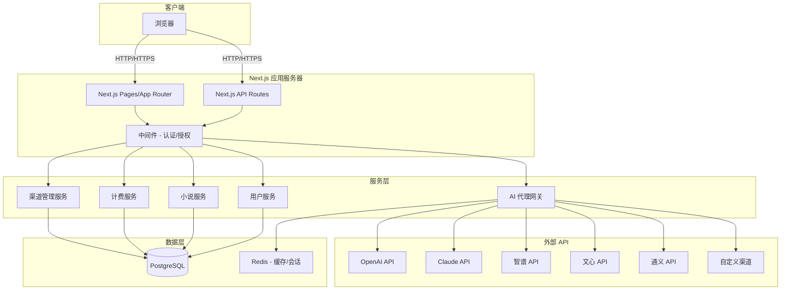

# 小说编写平台技术设计

Feature Name: novel-writing-platform
Updated: 2026-05-03

## 描述

一个基于 Next.js 的全栈小说编写平台，提供用户注册登录、管理员接口授权、后台管理 API 渠道和模型定价、AI 辅助编写、章节管理和按 token 计费系统。数据库使用 PostgreSQL。

## 架构



### 架构说明

- **前端**: Next.js App Router + React + TypeScript
- **后端**: Next.js API Routes + Server Actions
- **数据库**: PostgreSQL（主数据库）
- **缓存**: Redis（会话、请求限流）
- **ORM**: Prisma
- **AI 代理网关**: 统一封装多个大模型 API，支持负载均衡和故障转移
- **认证**: NextAuth.js + JWT

## 组件和接口

### 1. 用户服务 (UserService)

**接口**:
- `register(email, password)` - 用户注册
- `login(email, password)` - 用户登录
- `getProfile(userId)` - 获取用户信息
- `updateProfile(userId, data)` - 更新用户信息
- `grantAdminRole(userId, adminCode)` - 授予管理员权限

### 2. 小说服务 (NovelService)

**接口**:
- `createNovel(userId, novelData)` - 创建小说
- `getNovel(userId, novelId)` - 获取小说详情
- `updateNovel(userId, novelId, data)` - 更新小说
- `deleteNovel(userId, novelId)` - 删除小说
- `listNovels(userId)` - 列出用户的所有小说

### 3. 章节服务 (ChapterService)

**接口**:
- `createChapter(novelId, chapterData)` - 创建章节
- `getChapter(chapterId)` - 获取章节内容
- `updateChapter(chapterId, content)` - 更新章节
- `deleteChapter(chapterId)` - 删除章节
- `listChapters(novelId)` - 列出所有章节
- `reorderChapters(novelId, order)` - 重新排序章节

### 4. AI 代理网关 (AIGateway)

**接口**:
- `generate(prompt, model, options)` - 生成文本
- `estimateCost(model, inputTokens, outputTokens)` - 预估费用
- `selectChannel(model)` - 选择可用渠道
- `fallbackGenerate(prompt, model, fallbackModels)` - 故障转移生成

### 5. 计费服务 (BillingService)

**接口**:
- `calculateCost(modelId, inputTokens, outputTokens)` - 计算费用
- `deductBalance(userId, amount)` - 扣除余额
- `getBalance(userId)` - 查询余额
- `getUsageHistory(userId, pagination)` - 获取使用记录
- `grantInitialBalance(userId)` - 发放初始额度

### 6. 渠道管理服务 (ChannelService)

**接口**:
- `createChannel(adminId, channelData)` - 创建 API 渠道
- `updateChannel(adminId, channelId, data)` - 更新渠道配置
- `deleteChannel(adminId, channelId)` - 删除渠道
- `listChannels()` - 列出所有渠道（含状态）
- `getEnabledChannels()` - 获取启用的渠道列表
- `setModelPricing(adminId, modelId, inputPrice, outputPrice)` - 设置模型定价

## 数据模型

### User（用户表）

```prisma
model User {
  id              String    @id @default(cuid())
  email           String    @unique
  passwordHash    String
  role            Role      @default(USER)
  balance         Decimal   @default(2.00)
  apiKey          String?   @default(null)  // 用户自定义 API 密钥（加密存储）
  createdAt       DateTime  @default(now())
  updatedAt       DateTime  @updatedAt
  
  novels          Novel[]
  usageRecords    UsageRecord[]
  
  @@index([email])
}

enum Role {
  USER
  ADMIN
}
```

### Novel（小说表）

```prisma
model Novel {
  id              String    @id @default(cuid())
  title           String
  genre           Genre     // 攻受文、男女文
  userId          String
  user            User      @relation(fields: [userId], references: [id])
  
  // 角色设定
  maleLeadName    String?   @default(null)
  maleLeadTraits  String?   @default(null)   // 男主性格特征
  femaleLeadName  String?   @default(null)
  femaleLeadTraits String?  @default(null)   // 女主性格特征
  
  chapters        Chapter[]
  createdAt       DateTime  @default(now())
  updatedAt       DateTime  @updatedAt
  
  @@index([userId])
}

enum Genre {
  BL      // 攻受文
  BG      // 男女文
  OTHER   // 其他
}
```

### Chapter（章节表）

```prisma
model Chapter {
  id              String    @id @default(cuid())
  novelId         String
  novel           Novel     @relation(fields: [novelId], references: [id])
  title           String
  content         String    @default("")
  order           Int
  wordCount       Int       @default(0)
  
  createdAt       DateTime  @default(now())
  updatedAt       DateTime  @updatedAt
  
  @@index([novelId])
  @@index([order])
}
```

### APIChannel（API 渠道表）

```prisma
model APIChannel {
  id              String    @id @default(cuid())
  name            String    // 渠道名称
  type            ChannelType
  baseUrl         String
  apiKey          String    // 加密存储
  models          Json      // 支持的模型列表 [{name, maxTokens, ...}]
  enabled         Boolean   @default(true)
  priority        Int       @default(0)  // 负载均衡优先级
  usageCount      Int       @default(0)
  lastUsed        DateTime? @default(null)
  
  pricing         ModelPricing[]
  createdAt       DateTime  @default(now())
  updatedAt       DateTime  @updatedAt
  
  @@index([type])
  @@index([enabled])
}

enum ChannelType {
  OPENAI
  CLAUDE
  ZHIPU
  WENXIN
  TONGYI
  CUSTOM
}
```

### ModelPricing（模型定价表）

```prisma
model ModelPricing {
  id              String    @id @default(cuid())
  channelId       String
  channel         APIChannel @relation(fields: [channelId], references: [id])
  modelId         String    // 模型标识
  inputPrice      Decimal   // 每百万输入 token 价格（元）
  outputPrice     Decimal   // 每百万输出 token 价格（元）
  
  createdAt       DateTime  @default(now())
  updatedAt       DateTime  @updatedAt
  
  @@unique([channelId, modelId])
  @@index([channelId])
}
```

### UsageRecord（使用记录表）

```prisma
model UsageRecord {
  id              String    @id @default(cuid())
  userId          String
  user            User      @relation(fields: [userId], references: [id])
  modelId         String
  channelId       String
  inputTokens     Int
  outputTokens    Int
  cost            Decimal   // 实际费用（元）
  novelId         String?   @default(null)
  chapterId       String?   @default(null)
  
  createdAt       DateTime  @default(now())
  
  @@index([userId])
  @@index([createdAt])
}
```

## 正确性属性

### 不变量

1. **余额非负**: 用户余额始终 >= 0
2. **额度守恒**: 用户初始额度 + 充值 - 消耗 = 当前余额
3. **渠道模型唯一性**: 同一渠道的同一模型只能有一个定价配置
4. **角色唯一性**: 每个用户只能有一个账户
5. **章节顺序连续**: 章节的 order 字段从 1 开始连续递增

### 约束

1. **权限检查**: 用户只能访问/修改自己的小说
2. **管理员验证**: 授予管理员角色需要有效的授权码
3. **API 密钥加密**: 所有 API 密钥必须加密存储
4. **计费准确性**: 费用计算必须精确到小数点后 4 位

## 错误处理

### 错误场景与处理策略

| 错误场景 | 处理策略 |
|---------|---------|
| 余额不足 | 返回 402，提示用户余额不足 |
| API 渠道故障 | 自动切换到备用渠道，记录错误日志 |
| API 限流 | 等待后重试，超过 3 次则返回错误 |
| 用户未登录 | 返回 401，重定向到登录页 |
| 权限不足 | 返回 403，显示无权访问 |
| 数据库连接失败 | 返回 500，记录错误并告警 |
| 无效请求参数 | 返回 400，显示具体错误字段 |
| 并发写入冲突 | 乐观锁重试，最多 3 次 |

### 错误码定义

```typescript
enum ErrorCode {
  INSUFFICIENT_BALANCE = 'INSUFFICIENT_BALANCE',
  API_CHANNEL_ERROR = 'API_CHANNEL_ERROR',
  RATE_LIMIT_EXCEEDED = 'RATE_LIMIT_EXCEEDED',
  UNAUTHORIZED = 'UNAUTHORIZED',
  FORBIDDEN = 'FORBIDDEN',
  INVALID_INPUT = 'INVALID_INPUT',
  INTERNAL_ERROR = 'INTERNAL_ERROR',
  CONCURRENCY_CONFLICT = 'CONCURRENCY_CONFLICT',
}
```

## 测试策略

### 单元测试

- **用户服务**: 注册、登录、密码加密、权限验证
- **计费服务**: 费用计算、余额扣减、并发安全
- **AI 网关**: 渠道选择、负载均衡、故障转移
- **数据模型**: Prisma schema 验证、索引优化

### 集成测试

- **API 端点**: 所有 REST API 的请求/响应
- **认证流程**: 登录、JWT 验证、会话管理
- **数据库操作**: 事务、并发、外键约束
- **外部 API 调用**: Mock 大模型 API 响应

### 端到端测试

- **用户流程**: 注册 -> 登录 -> 创建小说 -> AI 编写 -> 查看账单
- **管理员流程**: 登录 -> 添加渠道 -> 设置定价 -> 查看统计
- **计费流程**: 发起请求 -> 计算费用 -> 扣减余额 -> 记录日志

### 性能测试

- **并发用户**: 模拟 100 并发用户同时使用 AI 编写
- **数据库查询**: 关键查询的响应时间 < 100ms
- **AI 响应延迟**: 从请求到响应的端到端延迟 < 10s

## 参考

[^1]: (Prisma ORM) - [PostgreSQL 文档](https://www.prisma.io/docs/getting-started/setup-prisma/start-from-scratch/relational-databases-typescript-postgresql)
[^2]: (NextAuth.js) - [认证文档](https://next-auth.js.org/getting-started/introduction)
[^3]: (Next.js) - [App Router 文档](https://nextjs.org/docs/app)

## 部署方案

### Docker 容器化部署

```yaml
# docker-compose.yml
services:
  app:
    build: .
    ports:
      - "3000:3000"
    environment:
      - DATABASE_URL=postgresql://user:pass@db:5432/novel_platform
      - REDIS_URL=redis://redis:6379
    depends_on:
      - db
      - redis
  
  db:
    image: postgres:16-alpine
    environment:
      - POSTGRES_USER=user
      - POSTGRES_PASSWORD=pass
      - POSTGRES_DB=novel_platform
    volumes:
      - pgdata:/var/lib/postgresql/data
  
  redis:
    image: redis:7-alpine
    volumes:
      - redisdata:/data

volumes:
  pgdata:
  redisdata:
```

### 传统部署（npm 直接运行）

```bash
# 安装依赖
npm install

# 初始化数据库
npx prisma generate
npx prisma db push

# 构建项目
npm run build

# 启动服务
npm start
```

### 构建产物

- Dockerfile（生产环境）
- docker-compose.yml（开发/测试环境）
- .env.example（环境变量模板）
- deploy.sh（一键部署脚本）
